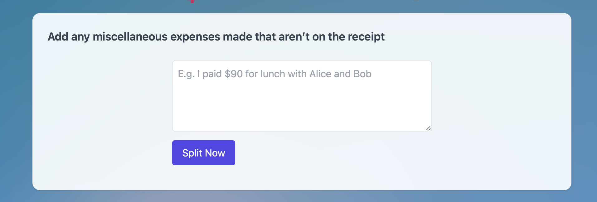
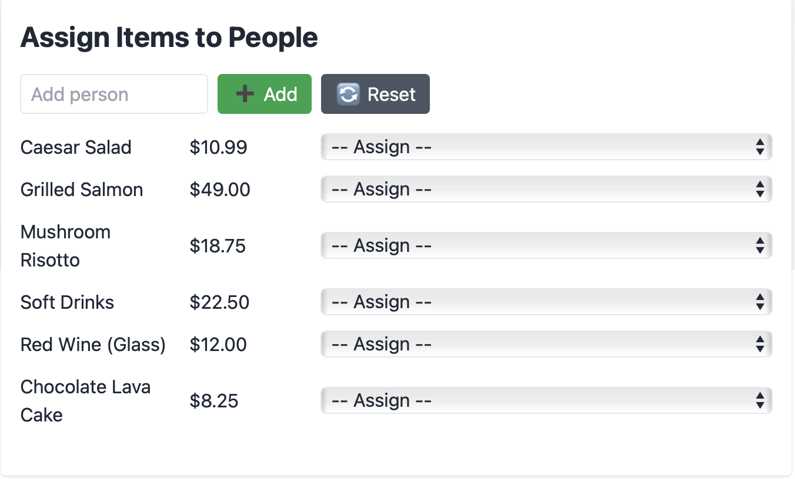
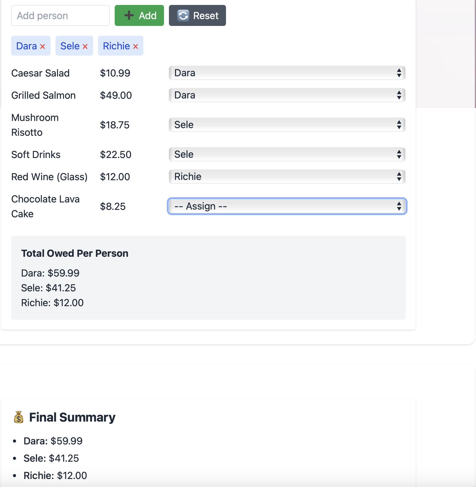
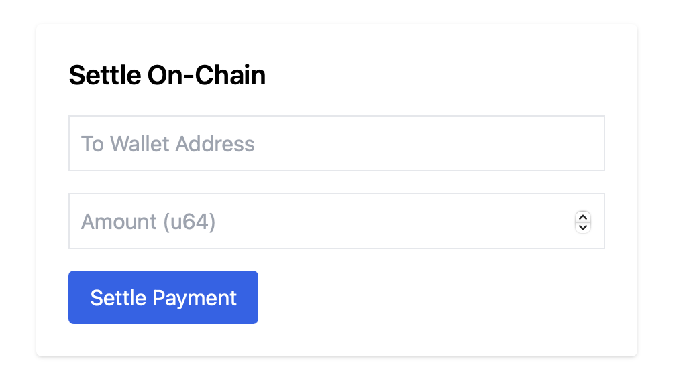

# 🧾 spLITTY — AI-Powered Crypto Expense Splitter

> Offers an AI-powered crypto expense splitter to help friend groups settle shared bills on-chain with zkLogin wallets and Aptos Move contracts.

---

## 📽 Demo Video

▶️ Watch the live demo here:  
<!--[](https://youtu.be/YOUR_VIDEO_ID) --> 

---

## 🖼 UI Screenshots

| Login | Receipt Upload & AI Parsing | Final Summary | Wallet Display |
|-------------|-----------------------------|---------------|----------------|
|  |    |  |   |

---

## 📋 What It Does

spLITTY is a smart bill splitter for friend groups that lets users:
- Upload a receipt or type in expenses
- AI parses and splits the total fairly
- Log those expenses on-chain using Move smart contracts
- Settle balances directly on Aptos — no third-party app, no trust needed

It’s like Splitwise — but on-chain and walletless.

---

## ⚙️ How It Works with the Blockchain

### ✅ Onboarding
- We use **Aptos zkLogin SDK** to generate a wallet tied to a Google account (no seed phrase).
- The wallet address is stored in Firestore and displayed in the UI.

### ✅ Logging Expenses
- On clicking “Save Summary,” each item is submitted via `log_expense()` to the deployed **Move smart contract**.
- The contract records who paid and how much into an on-chain `Group` resource.

### ✅ Settling Payments
- The `SettlePage` lets users input a wallet address and amount.
- This triggers the `settle()` function to update balances **directly on-chain**.

### ✅ Viewable on Aptos Explorer
Every action — `log_expense`, `settle` — is a real transaction on the **Aptos Testnet**.

---

## 🧪 Tech Stack

| Layer | Tech |
|-------|------|
| Frontend | React + Tailwind + Vite |
| Backend | Node.js + Express (Gemini/OpenAI for parsing) |
| Auth | Firebase Auth + **Aptos zkLogin SDK** |
| Database | Firebase Firestore |
| Blockchain | Aptos Move Smart Contracts deployed on Testnet |

---

## 🛠 Aptos-Specific Features

| Feature | How We Used It |
|---------|----------------|
| `zkLogin` | Made walletless UX possible for Google users |
| `AptosClient` | Signed and submitted transactions from frontend |
| `Move` Contracts | Defined Group, Expense, and on-chain balance logic |

---

## 🗂 Project Structure

```bash
spLITTY/
├── frontend/              # React app with zkLogin, receipt parsing, wallet UI
│   ├── src/
│   │   ├── components/
│   │   ├── context/AuthContext.jsx
│   │   ├── pages/
│   │   ├── aptos/contractClient.js  # Handles all blockchain calls
│   │   └── ...
│   └── public/
│
├── backend/               # Node.js backend with Gemini OCR + API routes
│   ├── controllers/
│   ├── services/
│   └── ...
│
├── move/                  # Aptos Move smart contract
│   ├── sources/GroupSplitter.move
│   └── Move.toml
